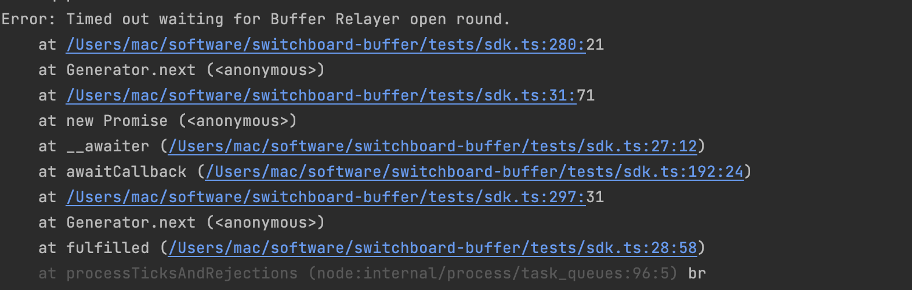

## Problem

Eventually the crank or the relaybuffer will stop working



### How to run

Run `solana-test-validator`

Run `anchor run switch`

Then comment out lines 25 - 29 in 
`/runOracle.ts`

Stop solana-test-validator

Run `.switchboard/start-local-validator.sh`

Run `anchor run switch` again

Copy oracle public key from terminal output
```
agg EtdenVDgsVxfWMDm6Y3Dwc8L3p8C3FpSgXjh5cvjizno oracle 3XQvDJ5wM9JPhELKu8PcvdFxPT19uo8m9rMtwzdjz1cc 3rGrMUKPVp8NzxC7pwxcj4hR3aHmCyKuFFVngH23UYTJ
```

Change line 14 in `.switchboard/docker-compose.switchboard.yml` to
` - ORACLE_KEY=${O}`

Replace `dev-v2-07-18-22` in `.switchboard/docker-compose.switchboard.yml`
with `dev-v2-09-19-22`

Run `O=<oracle public key> .switchboard/start-oracle.sh`

Run `anchor run server`

Run `anchor test --skip-local-validator`

Run `solana account target/deploy/switchboard_buffer-keypair.json`
and copy public key
```
Public Key: 9PcDy77KoSA9bNNuq7jQMczSmJg8rPFyAT9Ctt2APu3Y
Balance: 0.00114144 SOL
Owner: BPFLoaderUpgradeab1e11111111111111111111111
Executable: true
Rent Epoch: 0
Length: 36 (0x24) bytes
0000:   02 00 00 00  38 7e 2a 0b  0e 99 31 f7  dc 18 3d c1   ....8~*...1...=.
0010:   67 f1 7e c9  fd 19 b8 96  fb c2 bd 42  11 d3 55 6a   g.~........B..Uj
0020:   e9 6d 24 83 
```

Update line 32 in `programs/switchboard-buffer/src/lib.rs`
and line 6 in `Anchor.toml` with public key from previous step

Run `anchor test --skip-local-validator` finally